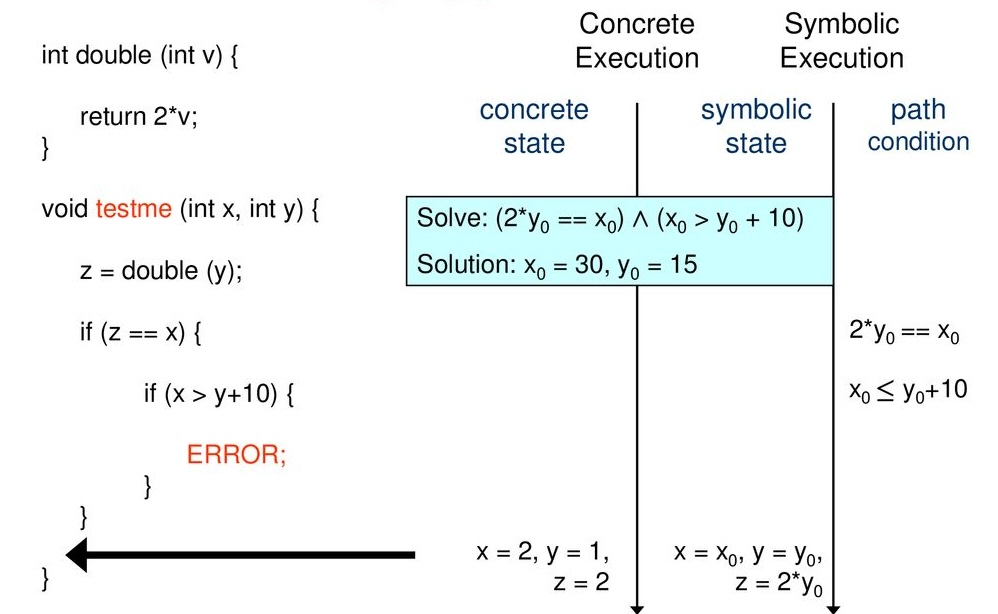

In this blog, we will be discussing automated unit testing, various techniques used in the industry and python packages essential for parsing C code. We will also be discussing the approach I developed during my internship at OmniVision Technologies.

### What is unit testing?

Unit testing is the process of fragmenting the code into smaller functional units and performing individual tests on these units. Unit testing has become a crucial part of the software testing lifecycle. It enables developers to identify bugs, logical flaws as well as decipher inputs which increase code coverage.

<!-- <figure align="center" id="fig1">
    
    <figcaption>Figure 1. Software Testing Life Cycle</figcaption>
</figure> -->



[Figure 1](#fig1) highlights the various stages of software testing life cycle (STLC). The first four steps of STLC: test plan, analysis, design, development, require a lot of manual work as well as time to implement. Automated unit testing targets these four steps to reduce the time taken in generating these tests as well as to develop tests with higher code coverage.

In the following sections, we will be discussing two most commonly used unit testing techniques: randomized testing and concolic testing.

### Randomized Testing

Randomized testing involves testing a program iteratively using random, independent inputs. The example below shows a simple absolute function which takes in as input an integer and returns its absolute value.


def abs(x: int):
    if x > 0:
        return x
    else:
        return x # Bug: should be '-x'


Let's assume, the random input generator generates {18, 31, 3, 21, -15}. '-15' is the only input which will trigger the bug.


def testAbs(n: int):
    for i in range(n):
        x = random.randint(-1000, 1000)
        result = abs(x)
        assert(result >= 0)


A naive randomized unit test generation technique which I explored during my internship included extracting the arguments and their datatypes. The datatype of each argument was used to set a range of values from which a random value would be generated for the corresponding argument.

Provided below is an example of a target function


int execute(int a, int b){
    if (a>20){
        if (b < 15){
            printf("GOAL!");
            return a-b;
        }
    else
        return -1;
}


For the example, above the algorithm would fetch the arguments for function using its abstract syntax tree (AST). Here since both arguments are integers, therefore the random values for _a_ and _b_ would be generated within the range \[-2<sup>32</sup>, 2<sup>32</sup>\). The GOAL condition would be achieved for all _a>20_ and _b<15_.

Randomized testing leads to generation of similar data and increases time required to generate useful unit tests. An alternative to randomized testing is concolic testing which has shown to be more effective in generating unit tests. Recently, large language models (LLM) have also been utilized to efficiently generate unit tests.

### Concolic Testing

Concolic testing can be defined as automation of test input generation process by using the concrete and symbolic, also known as concolic, execution of the code <d-cite key="10.1145/1321631.1321746"></d-cite>.

<!-- ([Sen, 2007](#references)).  -->

As defined above, concolic testing can be divided into two subprocesses:

1. **Concrete execution:** This subprocess involves the normal execution of the target code with the provided inputs.
2. **Symbolic execution:** This subprocess involves collecting all the symbolic constraints over a set of symbolic inputs at each branch point which is encountered during concrete execution such as conditional statements, function calls, etc.

SMT solvers such as <d-cite key="yices"></d-cite> and <d-cite key="10.5555/1792734.1792766"></d-cite> are used in the symbolic execution stage to solve the constraints and keep track of the branches which have been explored.

<!-- [yices](#references) and [z3](#references) -->

Koushik Sen's example of concolic testing is depiceted in [Figure 2](#fig2). It shows how for a given target code the concrete and symbolic execution is performed.

<!-- <figure align="center" id="fig2">
    
    <figcaption>Figure 2. Concolic testing</figcaption>
</figure> -->



As it can be seen, in order to reach the ERROR statement, variables x, y and z were encountered and their symbolic representations were also recorded which were $$ x=x_0, y=y_0 $$ and $$ z=2*y $$. Additionally, the conditions encountered during the concrete execution were also collected. In order to reach the ERROR statement, both the path conditions must satisfy, hence a symbolic constraint is generated
$$(2*y_0 == x_0) \land (x_0 > y_0 + 10)$$

In order to solve the constraint above, an SMT solver can be used which would return values for $$x_0$$ and $$y_0$$ which would satisfy the constraint.

#### Background

In this section, I will be discussing two concolic testing techniques which I studied and implemented as part of my internship. These two algorithm have been adopted by the community and prior work has been done to make these approaches more efficient.

##### Direct Automated Random Testing (DART)

DART <d-cite key="10.1145/1064978.1065036"></d-cite> is a software testing algorithm which automates the process of generating and executing test cases for programs. DART combines three key techniques:

<!-- ([Godefroid, 2005](#references))  -->

- **Interface extraction:** DART can automatically extract the program's interface by parsing the source code. The interface extracted include external variables, functions and arguments with which the program interacts.
- **Random test generation:** DART employs a test driver which performs random testing on the extracted interface in order to simulate all possible inputs that the program may encounter.
- **Dynamic test generation with symbolic execution:** DART also analyzes the program's control flow during random testing to generate new inputs to explore different execution paths. This is done by collecting symbolic constraints from conditionals statements and systematically solving and directing the program's execution.

The pseudo code below provides a systematic explanation of how the algorithm functions.


function DART(program, initial_input): # Initialize with initial random input
    input_queue = [initial_input]
    explored_paths = set()

    while input_queue is not empty:
        # Fetch the next input to test
        input_vector = input_queue.pop()

        # Execute program with current input and generate the executed path and constraints encountered
        execution_trace, path_constraints = execute_program(program, input_vector)

        # Record the current path as explored
        explored_paths.add(execution_trace)

        # For each condition in the path constraints
        for i in range(0, len(path_constraints)):
            # Negate the i-th condition to explore a new path
            new_constraints = negate_condition(path_constraints, i)

            # Check if the new path has been explored
            if new_constraints not in explored_paths:
                # Solve for new input vector using SMT solver
                new_input = solve_constraints(new_constraints)

                # If solvable, add the new input to the queue
                if new_input is not None:
                    input_queue.append(new_input)
                # Mark the path as explored
                explored_paths.add(new_constraints)

    return explored_paths


The function DART(...) highlights the core of the algorithm. The algorithm takes random inputs along with the program as arguments, which are later used to generate the execution trace and the path constraints encountered. The execution trace is stored to keep tracks of paths covered. The path constraints are then traveresed to explore different branches in the program by negating each path constraint one at a time. The new path constraints are solved using an SMT solver. If the conditions are satisfied, record the new inputs and new constraints. Lastly, after each condition has been traversed, return the explored paths which can be used calculate the code coverage. The paper can be found [here](https://dl.acm.org/doi/10.1145/1064978.1065036).

##### CREST - Concolic test generation tool for C

CREST <d-cite key="4639362"></d-cite> builds on top of the concept of concolic testing by introducing several heuristic search strategies aimed at improving the effectiveness and scalibility of concolic testing for large software programs. For detailed information on crest, you can visit their website [here](https://www.burn.im/crest/).

<!-- ([Burnim, 2008](#references)) -->

Listed below are some terminology which will help understand the pseudo code better.

- **Termination Condition:** This typically checks if the search has exhausted its iteration budget or met other predefined criteria (e.g., sufficient coverage).
- **Branch Selection:** Different strategies have their own methods for selecting which branch to explore next.
- **Forcing Execution:** Forcing a branch means modifying the path conditions to ensure the program follows the desired path during the next execution.
- **Updating the Control-Flow Graph (CFCG):** This is done to incorporate newly discovered paths into the search strategy, helping the algorithm to explore unexplored branches.
- **Attempt Counter:** Keeps track of how many times a branch has been forced to avoid redundant or unsuccessful attempts.

The three main strategies in this work are as follows:

- **Control-Flow Graph (CFG) Directed Search**

    This strategy leverages the control flow graph of a program to direct the testing process. The idea is to prioritize paths that are closer to uncovered branches, thereby improving coverage efficiency.

    **Process**

    - Construct the combined control flow and static call graph (CFCG) for the program.
    - For each branch encountered during execution, calculate the shortest path in the CFCG to any uncovered branch.
    - Force the execution along paths that move closer to these uncovered branches.
    - If a new branch is covered, update the CFCG and continue.

    **Pseudo Code**

    
    function CfgDirectedSearch(program P, initial_path p): # Continue searching until the termination condition is met
        while not termination_condition():

            # Select the branch from the current path that has the shortest distance to any uncovered branch
            branch_to_force = select_branch_with_min_distance_to_uncovered(p)

            # Attempt to force execution along the selected branch to generate a new path
            new_path = force_branch(branch_to_force)

            # Check if forcing the branch led to covering a new branch
            if new_branch_covered(new_path):

                # Update the control flow graph with the newly covered branch
                update_CFCG_with_new_branch()

                # Set the current path to the new path for the next iteration
                p = new_path
            else:
                # If no new branch is covered, increment the attempt counter for the selected branch
                increment_attempt_counter(branch_to_force)

        # Return the set of branches that have been covered by the search
        return covered_branches

    

- **Uniform Random Search**

    This approach uniformly samples the execution path space by assigning equal probabilities to taking true or false branches during execution.

    **Process**

    - Start from an initial execution path.
    - Randomly decide whether to terminate the current path or pick a branch to force.
    - If a branch is chosen, force it and generate a new path.
    - Continue the process until the desired number of paths are generated.

    **Pseudo Code**

    
    function UniformRandomSearch(program P, path p): # Initialize the position in the current execution path
        i = 0

        # Continue until the termination condition is met
        while not termination_condition():

            # Randomly select a branch from the current path based on a probability distribution
            j = select_random_branch_with_prob(p, i)

            # If a valid branch is selected
            if j is valid:

                # Force the execution along the selected branch to generate a new path
                new_path = force_branch(p, j)

                # Update the current path to the new path
                p = new_path

                # Move the position forward in the path
                i = j + 1
            else:
                # Terminate the search if no valid branch is found to force
                return p

        # Return the final execution path after the search
        return p
    

- **Random Branch Search**

    A simpler, more practical approach that randomly selects a branch to force at each iteration, focusing on exploration rather than uniformity.

    **Process**

    - At each step, randomly select a branch from the current execution path.
    - Force the branch and update the execution path.
    - If no new branches are covered after a certain number of iterations, restart the search.

    **Pseudo Code**

    
    function RandomBranchSearch(program P, path p): # Continue searching until the termination condition is met
        while not termination_condition():

            # Randomly select a branch from the current execution path
            random_branch = select_random_branch(p)

            # If the selected branch is valid for forcing
            if random_branch is valid:

                # Force the execution along the selected branch to generate a new path
                new_path = force_branch(p, random_branch)

                # Update the current path to the new path
                p = new_path
            else:
                # If no valid branch is found, restart the search with a new input
                restart_search_with_new_input()

        # Return the set of branches that have been covered by the search
        return covered_branches

    

Originally, crest was implemented with Yices SMT solver which does not support non-linear operations. Later on, Heechul implemented crest with Z3 solver to enable non-linear operations. The implementation of crest-z3 can be found [here](https://github.com/heechul/crest-z3).

### Depth First Search (DFS) Approach

In this section, we will discussing the DFS based approach I developed during my internship at OmniVision. The key feature of this approach is that it does not require instrumentation and uses the SMT solvers ability to solve symbolic expressions to generate efficient unit test inputs. Furthermore, this approach was implemented in Python which required the dependencies of the software significantly.

**Instrumentation:** It is a process of modifying software such that analysis can be performed on it. It allows logging the state of variables during test runs, which is an advantage during software testing. DART and Crest use instrumentation to update and monitor the state of the target inputs.

The DFS-based approach can be divided into three key stages:

- **Traverse and extract information from the abstract syntax tree (AST)**
    For a given target program, the approach first generates its AST which will be used in the following stages. The AST is then traveresed to generate a binary tree using the conditional statements. The left nodes in the tree represent the true blocks and the right nodes represent the false blocks.
- **Convert conditions to SMT format**
    In this stage, the conditions in the tree are traversed and converted to the desired SMT format. Additionally, the variables in the symbolic expression are converted to only include the arguments to the target function, if possible. An example of this process is shown below.

    For a given target function _execute_,

        ```C
        int execute(int a, int b, int d){
            int c = a + b;
            if (c<20){
                return -1;
            }
            else if (c<500){
                return c%d;
            }
            else
                return c*d;
        }
        
        ```

    [Figure 3]("fig3") below shows how the binary tree generated for the function _execute_ will look. In this binary tree _c_ will be replaced with '$$a+b$$', which will convert the conditionals to '$$a+b<20$$' and '$$a+b<500$$'.
    
    <figure align="center" id="fig3">
       
       <figcaption>Figure 3. Binary tree for execute(...)</figcaption>
   </figure>

    The reason for substituting the variables in terms of the arguments is to explore different uncovered paths and generate inputs which help explore different paths using the SMT solver.

- **DFS traversal**

    In this stage, the acquired binary tree is traversed to discover new paths. The pseudo code below shows the algorithm.

        
        function DFS(node, SMT_solver): 
            # If the node is empty, return since there's no condition to process
            if not node.value:
                return

            # Add the current condition to the path and mark it as visited
            path.append(node.value)
            visited.add(node.value)

            # Traverse the true (left) branch if it exists
            if node.left:
                DFS(node.left, SMT_solver)
                # Solve the path using the SMT solver and store the resulting test inputs
                test_inputs.append(SMT_solver.solve(path))

            # Negate the last condition to explore the false (right) branch
            path[-1] = Negate(path[-1])

            # Traverse the false (right) branch if it exists
            if node.right:
                DFS(node.right, SMT_solver)
                # Solve the path using the SMT solver and store the resulting test inputs
                test_inputs.append(SMT_solver.solve(path))

            # After exploring both branches, solve the path with all conditions negated
            path[-1] = Negate(path[-1])
            test_inputs.append(SMT_solver.solve(path))

            # Return the generated test inputs and the set of visited paths for coverage analysis
            return test_inputs, visited

        


    When _DFS_ is invoked on the tree in [fig. 3](#fig3), it will encounter two conditionals: $$a+b<20$$ and $$a+b<500$$.

    - **Initial Path:** The first condition encountered is $$a+b<20$$. This path is passed to the SMT solver, which might return $$a = 0$$ and $$b = 0$$ as solutions satisfying the constraint.
    - **True Branch Traversal:** DFS will then explore the true (left) branch. If it’s None, the path will be modified to $$!(a + b < 20)$$, and DFS will proceed to the false (right) branch.
    - **False Branch Traversal:** In this branch, the path becomes $$!(a + b < 20) ∧ (a + b) < 500$$. The SMT solver might return $$a = 21$$ and $$b = 0$$ as solutions.
    - **Final Path:** The final step involves generating a solution for the scenario where all conditions are false, i.e., $$!(a + b < 20) ∧ !(a + b < 500)$$. A possible solution could be $$a = 495$$ and $$b = 10$$.
    - **Termination:** The recursion terminates once all conditions have been explored, and the collected solutions are returned.

    This process effectively explores all paths in the tree, generating unit test inputs for each possible path and providing the necessary information to assess code coverage.

This approach was tested on Heechul's test suite which can be found [here](https://github.com/heechul/crest-z3/tree/master/test). The development of the DFS approach is still in its native stage and requires improvement on including various functionalities such as loops and in-built function calls.

During my internship, I was able to implement the following functionalities:

- Support for non-linear arithmetic
- Support for array operations
- Support for function calling

### Resources

In this section, I will providing a short tutorial on the available python packages that can help implement the logic for the DFS approach. We will be exploring two packages in this tutorial:

- **pycparser:** parser for parsing c code written in pure Python
- **z3solver:** python bindings for Z3 SMT solver

#### pycparser

The official documentation for this library can be found [here](https://github.com/eliben/pycparser). The first step in using pycparser is installation, use the following command to install it.

```
> pip install pycparser
```

In order for pycparser to parse C code, it should receive preprocessed C code. In order to preprocess C code we can make use of `cpp` which handles preprocessing directives such as `#include` and `#define`, removes comments and other such tasks to prepare C code for compilation.

We can perform this preprocessing using pycparser's `parse_file` function. It will interact with `cpp`, provided it's in the PATH, or a path to it is provided.

Alternatives for `cpp` are also available such as `gcc` and `clang` using the `-E` flag. An example on how to use `parse_file` is provided below.


from pycparser import parse_file

ast = parse_file(filename, use_cpp=True,
            cpp_path='gcc',
            cpp_args=['-E', r'-Iutils/fake_libc_include'])


`filename` refers to the path to the C program. The code above will help in attaining the abstract syntax tree (AST) of the C code. The next step is to traverse the AST.

For instance, the C code under consideration is as follows.


int main() {
    int x = 10;
    if (x > 5) {
        x = x + 1;
    }
    if (x < 20) {
        x = x - 1;
    }
    return x;
}


The following code will help traverse the AST for if conditions.


    from pycparser import parse_file, c_ast

    ast = parse_file(filename, use_cpp=True,
                cpp_path='gcc',
                cpp_args=['-E', r'-Iutils/fake_libc_include'])

    # Function to recursively traverse the AST and find if conditions
    def find_if_conditions(node, indent=0):
        if isinstance(node, c_ast.If):
            # Print the condition of the if statement
            print(' ' * indent + f"If condition found: {node.cond.coord}")
            print(' ' * indent + f"Condition: {node.cond}")

        # Recursively traverse child nodes
        for child in node:
            find_if_conditions(child, indent + 2)

    find_if_conditions(ast)


The output will look something like this


If condition found at <c_code>:5:5:
Condition:
    BinaryOp (>)
    ID: x
    Constant: int, 5
If condition found at <c_code>:9:5:
Condition:
    BinaryOp (<)
    ID: x
    Constant: int, 20


The output can then be converted into SMT format to be processed by a solver using z3-solver python binding which will be discussed in the next section.

Since we can now extract the if statements, we can build our binary tree accordingly by assigning conditions in the `iftrue` block in the AST to the left node and the conditions in the `iffalse` block in the AST to the right node.


    class BinaryTreeNode:
        def __init__(self, value=None, left=None, right=None):
            self.value = value
            self.left = left
            self.right = right

    tree = []
    def convert2binary(node):
        if isinstance(node, c_ast.If):
            # call binary node creator function
            return handle_if(node)

        # Recursively traverse child nodes and append the return BinaryTreeNode object to tree
        for child in node:
            tree.append(convert2binary(child))

    def handle_if(node):
        cond = node.cond
        if_true = convert2binary(node.iftrue)
        if_false = convert2binary(node.iffalse)
        return BinaryTreeNode(cond, if_true, if_false)


The complete code will look as follows:


    from pycparser import parse_file, c_ast

    ast = parse_file(filename, use_cpp=True,
                cpp_path='gcc',
                cpp_args=['-E', r'-Iutils/fake_libc_include'])

    class BinaryTreeNode:
        def __init__(self, value=None, left=None, right=None):
            self.value = value
            self.left = left
            self.right = right

    tree = []

    def convert2binary(node):
        if isinstance(node, c_ast.If):
            # call binary node creator function
            return handle_if(node)

        # Recursively traverse child nodes and append the return BinaryTreeNode object to tree
        for child in node:
            tree.append(convert2binary(child))

    def handle_if(node):
        cond = node.cond
        if_true = convert2binary(node.iftrue)
        if_false = convert2binary(node.iffalse)
        return BinaryTreeNode(cond, if_true, if_false)

    convert2binary(ast)
    print(tree)


#### Z3 Solver

In this section, we will discussing how to use the z3 solver library to convert expression from the AST to Z3 format as well as how to use solve Z3 to solve symbolic expressions. The official documentation for Z3 can be found [here](https://z3prover.github.io/api/html/z3.html).

Z3 can be installed in python using the following command:

```
> pip install z3-solver
```

Converting a binary operation to Z3 format expression


    from z3 import *
    from pycparser import c_ast

    def convert_to_z3_format(cond):
        if isinstance(cond, c_ast.BinaryOp):
            left = convert_to_z3_format(cond.left)
            right = convert_to_z3_format(cond.right)

            if cond.op == '==':
                return left == right
            elif cond.op == '!=':
                return left != right
            elif cond.op == '<':
                return left < right
            elif cond.op == '>':
                return left > right
            elif cond.op == '<=':
                return left <= right
            elif cond.op == '>=':
                return left >= right
            elif cond.op == '&&':
                return And(left, right)
            elif cond.op == '||':
                return Or(left, right)
            elif cond.op == '+':
                return left + right
            elif cond.op == '-':
                return left - right
            elif cond.op == '*':
                return left * right
            elif cond.op == '/':
                return left / right

        elif isinstance(cond, c_ast.ID):
            return Int(cond.name)
        elif isinstance(cond, c_ast.Constant):
            if cond.type == 'int':
                return IntVal(int(cond.value))
            else:
                raise Exception(f"Unsupported constant type: {cond.type}")
        else:
            raise Exception(f"Unsupported condition: {type(cond)}")


The function `convert_to_z3_format` takes as input a condition extraction from the AST as shown in the previous section and converts it to a format which can be solved using the Z3 solver.

For instance when `convert_to_z3_format` is called on the following condition,

```
Condition:
    BinaryOp (op: >)
    ID: x
    Constant: int, 5
```

the output would be $x>5$ which can now be solved using the z3 solver as it of type `z3.ArithRef`.

##### Solving symbolic expressions

In this subsection, I will be discussing on solving symbolic expression using the Z3 solver. In order to understand the process of solving symbolic constraints using Z3, there are certains functions that one should be familiar with. For a detailed guide to Z3, please visit [here](https://ericpony.github.io/z3py-tutorial/guide-examples.htm).

- z3.Solver(): It creates a general purpose solver to which new constraints can be added or delete from.

  Example,

  ```
  s = z3.Solver()
  ```

- add(): This method allows us to add new constraints to the solver.
  Example,
  ```
    x = Int('x')
    y = Int('y')
    s.add(x > 10, y == x + 2)
  ```
- check(): The method _check()_ solves the asserted constraints. It returns _sat_ if a solution is found, else _unsat_ is returned.
- push(): The command _push_ creates a new scope by saving the current stack size.
- pop(): The command _pop_ restores the state of solver by removing any assertion performed between it and the matching _push_.
- model(): The method _model()_ provides us with the inputs that satisfy the constraints, if _check()_ returns _sat_.

Provided below is a simple example on how z3 solver can be used to attain inputs.


    from z3 import *

    def solve_constraints(conds):
        solver = Solver()
        for cond in conds:
            solver.add(cond)

        if solver.check():
            model = solver.model
            print ("traversing model...")
            # print the variables and their values required to solve the constraints
            for d in m.decls():
                print ("%s = %s" % (d.name(), m[d]))

        return model

    x, y, z = Real('x y z')
    conds = [x > 1, y > 1, x + y > 3, z - x < 10]
    solved_values = solve_constraints(conds)



Through this tutorial we have learnt how to parse C code using pycparser, convert the conditions to Z3 compatible format and solve them using Z3 solver. Now we can implement the DFS algorithm and explore more functionalities that pycparser and Z3 have to offer. Thank you for reading!

### References
1. https://www.initialyze.com/insights/unit-testing
2. Koushik Sen. 2007. Concolic testing. In Proceedings of the 22nd IEEE/ACM International Conference on Automated Software Engineering (ASE '07). Association for Computing Machinery, New York, NY, USA, 571–572. https://doi.org/10.1145/1321631.1321746
3. https://yices.csl.sri.com
4. https://microsoft.github.io/z3guide/docs/logic/intro/
5. https://www.cs.cmu.edu/~aldrich/courses/17-355-17sp/notes/lec-concolic-sen.pdf
6. Patrice Godefroid, Nils Klarlund, and Koushik Sen. 2005. DART: directed automated random testing. SIGPLAN Not. 40, 6 (June 2005), 213–223. https://doi.org/10.1145/1064978.1065036
7. Burnim, Jacob, and Koushik Sen. "Heuristics for scalable dynamic test generation." 2008 23rd IEEE/ACM International Conference on Automated Software Engineering. IEEE, 2008
